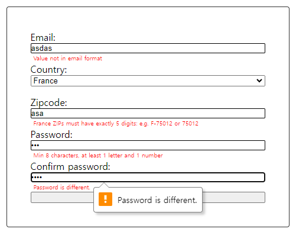

# validation-api

Live Preview: https://taewookim02.github.io/validation-api/

This project demonstrates form validation using JavaScript. The form includes fields for email, country, ZIP code, password, and password confirmation. The validation logic highlights invalid fields, provides helpful error messages, as well as sets custom validity alert messages.
